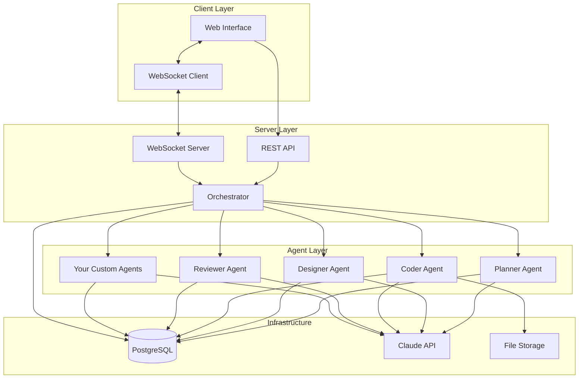
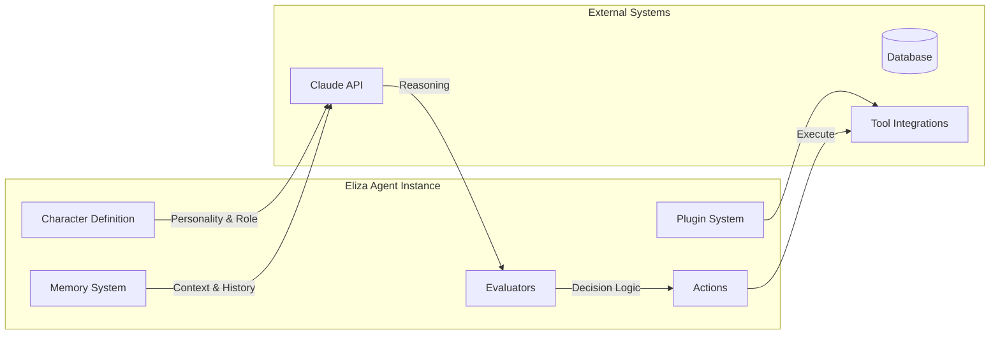
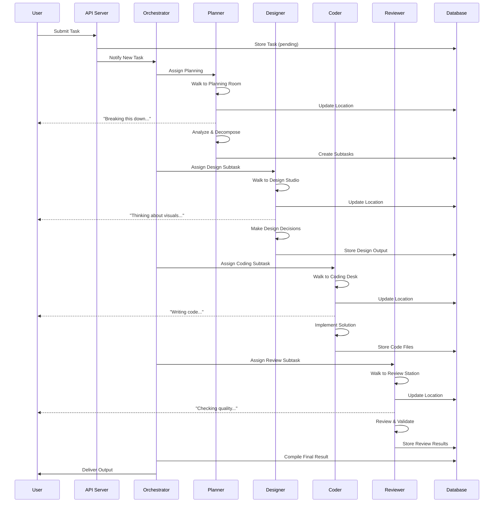
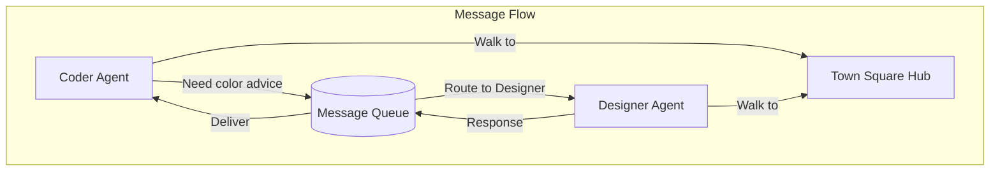
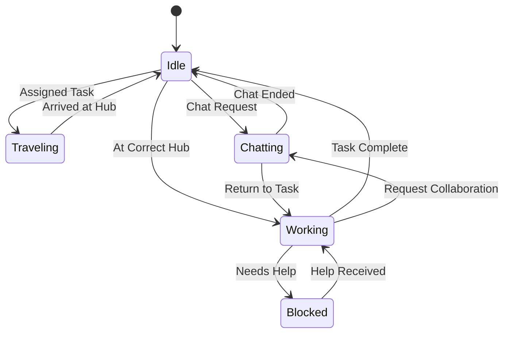
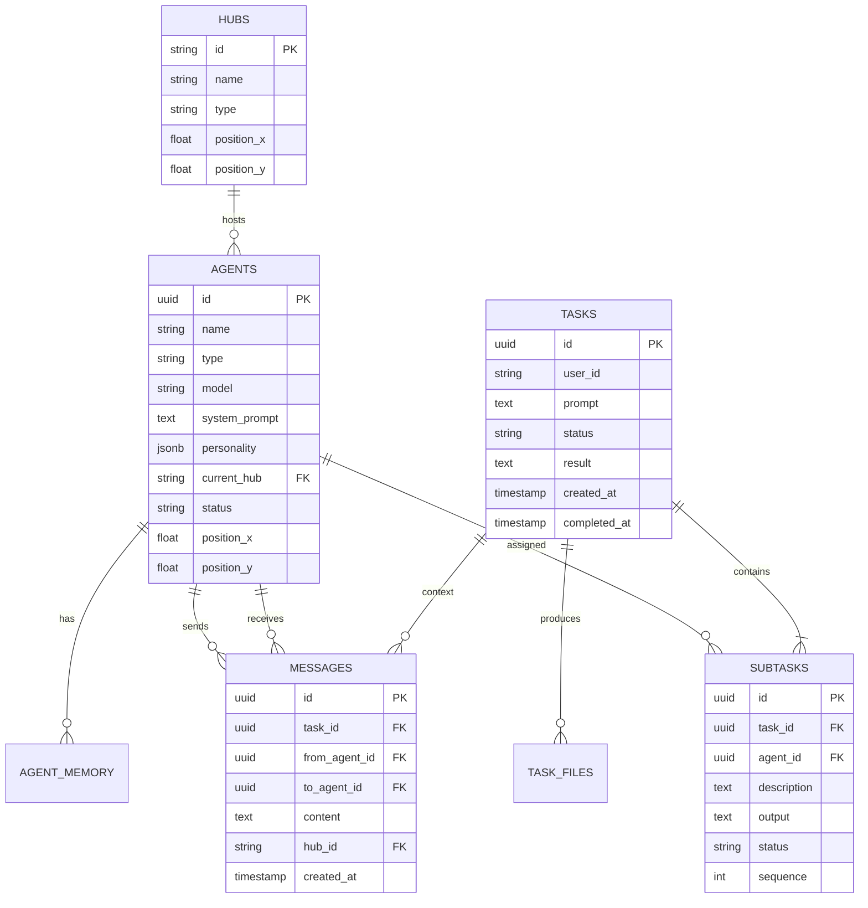

# Eliza Town

**An open source visual multi-agent orchestration system powered by Eliza OS**

Eliza Town is a 3D environment where autonomous AI agents collaborate to complete tasks. Watch agents navigate between workstations, communicate with each other, and produce real outputs. Fully customizable. Bring your own agents, assets, and workflows.


## Why Open Source

We believe agent orchestration should be hackable. Eliza Town is built for developers and creators who want to:

- **Create custom agents** with any personality, skillset, or purpose
- **Add your own 3D assets** including characters, buildings, and environments
- **Define new workflows** for any task type beyond software development
- **Integrate any tools** through Eliza's plugin system
- **Build on top** of a working foundation instead of starting from scratch


## Overview

Traditional AI assistants operate as single, monolithic entities. Eliza Town takes a different approach: specialized agents working together like a distributed team. Each agent has a distinct role, personality, and workspace. When you submit a task, you watch the team coordinate in real time.

This project implements the "Gas Town" architecture pattern, where agents run as persistent services communicating through shared state rather than direct function calls.

## Architecture

### System Overview



### How Eliza Powers the Agents

Eliza OS provides the foundational runtime for autonomous agents. Each agent in Eliza Town is an Eliza instance configured with:



**Character Definition**: Each agent has a distinct identity defined through system prompts, personality traits, and behavioral guidelines. The Planner thinks strategically. The Coder focuses on implementation. The Reviewer scrutinizes for quality. Or define your own.

**Memory System**: Agents maintain context across tasks through Eliza's memory architecture. They remember previous interactions, learn from outcomes, and build relationships with other agents.

**Plugin System**: Eliza's plugin architecture allows agents to interact with external tools. File system access, API calls, database queries, and deployment pipelines are all exposed as plugins.

**Evaluators and Actions**: Agents use evaluators to assess situations and actions to respond. When a Coder receives a task, evaluators determine the approach while actions execute the implementation.

### Task Lifecycle



### Agent Communication

Agents communicate through a message-passing system built on PostgreSQL. This follows the Gas Town philosophy of filesystem-style IPC adapted for database persistence.



### State Machine

Each agent follows a defined state machine:



## Customization

### Create Your Own Agents

Add new agents by creating a config in `src/agents/configs.js`:

```javascript
export const agentConfigs = {
  // Your custom agent
  researcher: {
    name: 'Researcher',
    hub: 'library',
    color: '#9966ff',
    model: 'claude-sonnet-4-20250514',
    system: `You are a Research agent. You find information, 
             verify facts, and provide sources for the team.`,
    personality: {
      traits: ['curious', 'thorough', 'analytical'],
      voice: 'academic but approachable'
    }
  },
  
  // Add as many as you want
  writer: { ... },
  translator: { ... },
  analyst: { ... }
}
```

Then add the agent to your database:

```sql
INSERT INTO agents (name, type, system_prompt, current_hub, color) 
VALUES ('Researcher', 'researcher', '...', 'library', '#9966ff');
```

### Add Custom Hubs

Create new workstations for your agents in `src/db/schema.sql`:

```sql
INSERT INTO hubs (id, name, description, type, position_x, position_y) VALUES
  ('library', 'Library', 'Research and reference', 'work', 7, 0),
  ('workshop', 'Workshop', 'Building and prototyping', 'work', -7, 0),
  ('garden', 'Garden', 'Creative brainstorming', 'social', 0, 7);
```

### Bring Your Own Assets

Drop your 3D models into `public/models/`:

```
public/models/
├── agents/
│   ├── researcher.glb      # Your custom character
│   ├── writer.glb
│   └── analyst.glb
├── hubs/
│   ├── library.glb         # Custom building
│   ├── workshop.glb
│   └── garden.glb
└── props/
    ├── desk.glb
    ├── computer.glb
    └── bookshelf.glb
```

**Supported formats**: GLB, GLTF

**Recommended sources**:
- [Kay Kit](https://kaylousberg.itch.io/) — Free low poly characters (CC0)
- [Sketchfab](https://sketchfab.com/) — Search "chibi", "low poly", "stylized"
- [Mixamo](https://mixamo.com/) — Free rigging and animations
- [Meshy](https://meshy.ai/) — AI generated 3D models
- [Poly Pizza](https://poly.pizza/) — Free low poly assets

**Animation requirements**:
Each character model should include these animation clips:
- `idle` — Breathing/standing
- `walk` — Walking cycle
- `work` — Typing/working gesture

### Define Custom Workflows

The orchestrator determines how agents collaborate. Modify `src/orchestration/loop.js` to create your own workflows:

```javascript
// Example: Content creation workflow
async function contentWorkflow(task) {
  // 1. Researcher gathers information
  await assignToAgent('researcher', 'Research the topic')
  
  // 2. Writer creates draft
  await assignToAgent('writer', 'Write first draft based on research')
  
  // 3. Editor reviews and polishes
  await assignToAgent('editor', 'Review and improve the draft')
  
  // 4. Translator localizes (optional)
  if (task.requiresTranslation) {
    await assignToAgent('translator', 'Translate to target languages')
  }
}
```

### Add Tool Integrations

Give agents new capabilities through plugins:

```javascript
// src/agents/plugins/github.js
export const githubPlugin = {
  name: 'github',
  actions: {
    createRepo: async (name, description) => { ... },
    createPR: async (repo, branch, title) => { ... },
    mergeCode: async (repo, prNumber) => { ... }
  }
}

// src/agents/plugins/slack.js
export const slackPlugin = {
  name: 'slack',
  actions: {
    sendMessage: async (channel, text) => { ... },
    createChannel: async (name) => { ... }
  }
}
```

## Features

| Feature | Description |
|---------|-------------|
| **Visual Orchestration** | Watch agents move through a 3D town as they work |
| **Custom Agents** | Create agents with any role, personality, or skillset |
| **Custom Assets** | Bring your own 3D characters, buildings, and props |
| **Extensible Workflows** | Define how agents collaborate on any task type |
| **Plugin System** | Integrate any external tool or API |
| **Real-time Updates** | WebSocket streaming of agent positions and speech |
| **Hub Navigation** | Agents travel to workstations appropriate for tasks |
| **Agent Communication** | Speech bubbles show inter-agent collaboration |
| **Persistent Memory** | Agents maintain context across sessions |
| **Real Output** | Generates actual files and deployable artifacts |

## Tech Stack

| Layer | Technology |
|-------|------------|
| Frontend | Three.js, WebSocket |
| Backend | Node.js, Express |
| Database | PostgreSQL |
| AI Runtime | Eliza OS |
| LLM | Claude API (Anthropic) |
| Real-time | WebSocket |

## Project Structure

```
eliza-town/
├── src/
│   ├── orchestration/
│   │   ├── loop.js          # Main tick loop (customize workflows here)
│   │   └── state.js         # Agent state machine
│   ├── agents/
│   │   ├── configs.js       # Agent definitions (add your agents here)
│   │   ├── claude.js        # LLM integration
│   │   └── plugins/         # Tool integrations (add plugins here)
│   ├── db/
│   │   ├── schema.sql       # Database schema (add hubs here)
│   │   ├── client.js        # Connection pool
│   │   └── queries.js       # Query helpers
│   ├── api/
│   │   ├── routes.js        # REST endpoints
│   │   └── websocket.js     # Real-time server
│   ├── workers/
│   │   ├── taskProcessor.js # Job queue
│   │   └── agentWorker.js   # Agent runtime
│   └── utils/
│       ├── pathfinding.js   # Movement logic
│       └── files.js         # Output handling
├── public/
│   ├── models/              # 3D assets (add your models here)
│   │   ├── agents/
│   │   ├── hubs/
│   │   └── props/
│   └── textures/            # Environment textures
├── index.html               # Frontend application
├── server.js                # Entry point
└── package.json
```

## Database Schema



## Getting Started

### Prerequisites

- Node.js 18+
- PostgreSQL 14+
- Anthropic API key

### Installation

```bash
# Clone the repository
git clone https://github.com/yourusername/eliza-town.git
cd eliza-town

# Install dependencies
npm install

# Configure environment
cp .env.example .env
# Edit .env with your credentials

# Initialize database
npm run db:setup

# Start the server
npm run dev
```

### Environment Variables

| Variable | Description |
|----------|-------------|
| `DATABASE_URL` | PostgreSQL connection string |
| `ANTHROPIC_API_KEY` | Claude API key from Anthropic |
| `PORT` | HTTP server port (default: 3000) |
| `AUTO_START_ORCHESTRATOR` | Start processing on boot |

## API Reference

### Tasks

| Method | Endpoint | Description |
|--------|----------|-------------|
| `POST` | `/api/tasks` | Create a new task |
| `GET` | `/api/tasks/:id` | Get task status and result |
| `GET` | `/api/tasks` | List all tasks |
| `POST` | `/api/tasks/:id/cancel` | Cancel a pending task |

### Agents

| Method | Endpoint | Description |
|--------|----------|-------------|
| `GET` | `/api/agents` | Get all agents |
| `GET` | `/api/agents/:id` | Get agent details |
| `PATCH` | `/api/agents/:id` | Update agent configuration |
| `POST` | `/api/agents/:id/move` | Move agent to hub |

### WebSocket Events

**Server to Client:**

| Event | Payload | Description |
|-------|---------|-------------|
| `agent_move` | `{ agent, from, to, hub }` | Agent started moving |
| `agent_status` | `{ agent, status, doing }` | Agent status changed |
| `agent_speak` | `{ agent, text, toAgent }` | Agent speech bubble |
| `agent_think` | `{ agent, text }` | Agent thought bubble |
| `task_complete` | `{ taskId, downloadUrl }` | Task finished |

## Example Use Cases

The default setup is configured for software development, but you can adapt Eliza Town for any collaborative workflow:

| Use Case | Agents | Description |
|----------|--------|-------------|
| **Content Creation** | Researcher, Writer, Editor, Publisher | Blog posts, articles, documentation |
| **Game Development** | Designer, Artist, Developer, QA | Game assets and code |
| **Data Analysis** | Collector, Analyst, Visualizer, Reporter | Research and reports |
| **Customer Support** | Triage, Specialist, Escalation, QA | Ticket handling |
| **Marketing** | Strategist, Copywriter, Designer, Analyst | Campaigns and content |
| **Education** | Curriculum, Content, Quiz, Feedback | Course creation |

## Community

### Contributing

We welcome contributions of all kinds:

- **New agents** — Share your agent configurations
- **Asset packs** — Contribute 3D models and textures
- **Plugins** — Build integrations with external tools
- **Workflows** — Create templates for different use cases
- **Documentation** — Improve guides and examples
- **Bug fixes** — Help us squash issues

See [CONTRIBUTING.md](./CONTRIBUTING.md) for guidelines.

### Showcase

Built something cool with Eliza Town? Open a PR to add it here:

- *Your project here*

## Roadmap

- [x] Core orchestration loop
- [x] Agent state machine
- [x] WebSocket real-time updates
- [x] Basic 3D visualization
- [ ] Asset marketplace
- [ ] OAuth integrations (Gmail, Slack, GitHub)
- [ ] Agent memory persistence
- [ ] Multi-user support
- [ ] Wallet integration
- [ ] Mobile app

## Related Projects

- [Eliza OS](https://github.com/elizaos/eliza) — The agent framework powering Eliza Town
- [Gas Town](https://steve-yegge.medium.com/) — The architectural pattern that inspired this project

## License

MIT License. See [LICENSE](./LICENSE) for details.

Use it however you want. Commercial use allowed. No attribution required (but appreciated).

---

Built with Eliza OS

**Star the repo if you find it useful. Fork it to make it yours.**
